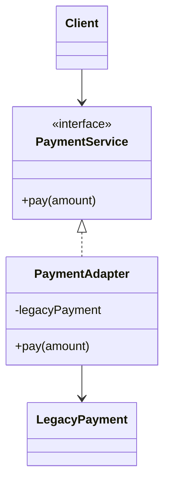

# 📌 Adapter Pattern

> 👉 호환되지 않는 인터페이스를 클라이언트가 기대하는 형태로 변환해 기존 코드를 변경 없이 재사용하게 해주는 패턴

## 📝 개요

이 문서는 **Adapter Pattern**을 정리한 문서입니다.
어댑터 패턴의 개념, 등장 배경, 해결하는 문제, Java 코드 예제, 구조(UML), 실무 사용 포인트를 종합적으로 정리합니다.

## 📚 핵심 요약

* 기존 클라이언트 코드를 변경하지 않고 새로운 구현을 연결할 수 있다
* 인터페이스 기반 설계를 통해 결합도를 낮춘다
* 외부 라이브러리, 레거시 코드, 서드파티 모듈 연동에 매우 유용하다
* 실무 인사이트: **외부 변경은 Adapter에서 끝내고, 내부 도메인은 고정한다**

## 1️⃣ 개념 정리

### ■ 배경

시스템을 운영하다 보면 이미 안정적으로 동작 중인 코드가 존재하는 상태에서,
새로운 라이브러리나 외부 모듈(PG사 결제, 외부 API, 레거시 시스템 등)을 도입해야 하는 상황이 자주 발생한다.

이때 새로 도입하려는 클래스의 인터페이스가 기존 클라이언트가 기대하는 인터페이스와 다를 경우,
클라이언트 코드를 직접 수정하면 변경 범위가 커지고 유지보수가 어려워진다.

### ■ 문제 상황

* 클라이언트 코드가 특정 구현 클래스에 강하게 의존함
* 외부 모듈 교체 시 클라이언트 수정 범위가 큼
* if-else / 분기 처리로 코드가 지저분해짐
* 테스트 및 확장 비용 증가

### ■ 왜 필요한가?

Adapter Pattern은 **기존 인터페이스(Target)** 와 **호환되지 않는 클래스(Adaptee)** 사이에
중간 계층(Adapter)을 두어 인터페이스 변환을 담당하게 한다.

이를 통해:

* 클라이언트는 기존 인터페이스만 의존
* 외부 구현 변경 시 Adapter만 수정
* 변경에 닫히고(OCP), 확장에 열려 있는 구조 유지

### ■ 구조/흐름
Adapter Pattern은 **Client – Target Interface – Adapter – Adaptee** 구조로 동작한다.
1. Client는 Target Interface에 의존
2. Adapter는 Target Interface를 구현
3. Adapter 내부에서 Adaptee를 구성(composition)
4. 요청을 Adaptee 호출로 변환하여 위임

### ■ 관련 디자인 원칙

* OCP (Open-Closed Principle)
* DIP (Dependency Inversion Principle)
* 캡슐화 (Encapsulation)
* 구성 우선 (Favor Composition Over Inheritance)

### ■ 간단 예시

한국 전자제품을 해외에서 사용하기 위해 전원 어댑터를 사용하는 것처럼,
소프트웨어에서도 기존 코드와 맞지 않는 인터페이스를 변환해 연결한다.

## 2️⃣ 예제 코드

### ✔ UML 다이어그램 (구조 요약)



### ✔ 구현 예제 1: Target Interface

```java
public interface PaymentService {
    void pay(int amount);
}
```

### ✔ 구현 예제 2: Adaptee (기존/외부 클래스)

```java
public class LegacyPaymentSystem {
    public void requestPayment(int price) {
        System.out.println("Legacy payment processed: " + price);
    }
}
```

### ✔ 구현 예제 3: Adapter

```java
public class PaymentAdapter implements PaymentService {

    private final LegacyPaymentSystem legacyPaymentSystem;

    public PaymentAdapter(LegacyPaymentSystem legacyPaymentSystem) {
        this.legacyPaymentSystem = legacyPaymentSystem;
    }

    @Override
    public void pay(int amount) {
        legacyPaymentSystem.requestPayment(amount);
    }
}
```


### ✔ 구현 예제 4: Client

```java
public class Client {
    public static void main(String[] args) {
        PaymentService paymentService =
            new PaymentAdapter(new LegacyPaymentSystem());

        paymentService.pay(1000);
    }
}
```


### ✔ 추가 예제: Enumeration → Iterator Adapter (Java)
※ Enumeration에는 삭제 개념이 없으므로,
Iterator의 remove()는 UnsupportedOperationException으로 처리한다.
이는 어댑터가 기능을 확장하지 않고 변환만 담당함을 명확히 드러낸다.

```java
public class EnumerationIteratorAdapter<T> implements Iterator<T> {

    private final Enumeration<T> enumeration;

    public EnumerationIteratorAdapter(Enumeration<T> enumeration) {
        this.enumeration = enumeration;
    }

    @Override
    public boolean hasNext() {
        return enumeration.hasMoreElements();
    }

    @Override
    public T next() {
        return enumeration.nextElement();
    }
   
    @Override
    public void remove() {
        throw new UnsupportedOperationException(
            "remove() is not supported for Enumeration"
        );
    }
}
```


## 3️⃣ 실무 포인트

### ■ 객체 어댑터 vs 클래스 어댑터

* 객체 어댑터: 구성을 활용, 유연하고 Java 실무에서 일반적으로 사용
* 클래스 어댑터: 상속 기반, 다중 상속 필요, Java에서는 제약적


### ✔ 언제 사용하면 좋은가?

* 외부 라이브러리 / SDK / PG 연동
* 레거시 코드와 신규 코드 공존
* 인터페이스가 서로 다른 시스템 연결

### ✔ 해결하는 문제

* 클라이언트 코드 변경 최소화
* 외부 변경 영향 범위 제한
* 테스트 및 유지보수 용이성 향상

### ✔ 잘못 적용하면 생길 문제

* Adapter 클래스 남발로 구조 복잡도 증가
* 변환 로직이 비대해지면 책임 과다
* Adapter 안에 비즈니스 로직이 섞이는 실수

### ✔ 실무에서 자주 발생하는 이슈

* Adapter에 조건 분기 로직 과도하게 추가됨
* 여러 Adapter 간 중복 코드 발생
* 인터페이스 설계 미흡으로 Adapter가 불필요해짐

### ✔ 프레임워크에서의 활용

* Spring: HandlerAdapter, ControllerAdapter
* JPA: EntityManager와 구현체 간 추상화
* Servlet API: Wrapper / Adapter 구조 다수 사용

## 4️⃣ 정리

Adapter Pattern은 기존 코드를 보호하면서 새로운 구현을 유연하게 수용하기 위한 핵심 패턴이다.
특히 외부 시스템 연동이 잦은 백엔드 환경에서 변경 범위를 제어하는 데 매우 효과적이다.
핵심은 **클라이언트는 인터페이스만 알고, 변환 책임은 Adapter에 맡긴다**는 점이다.

