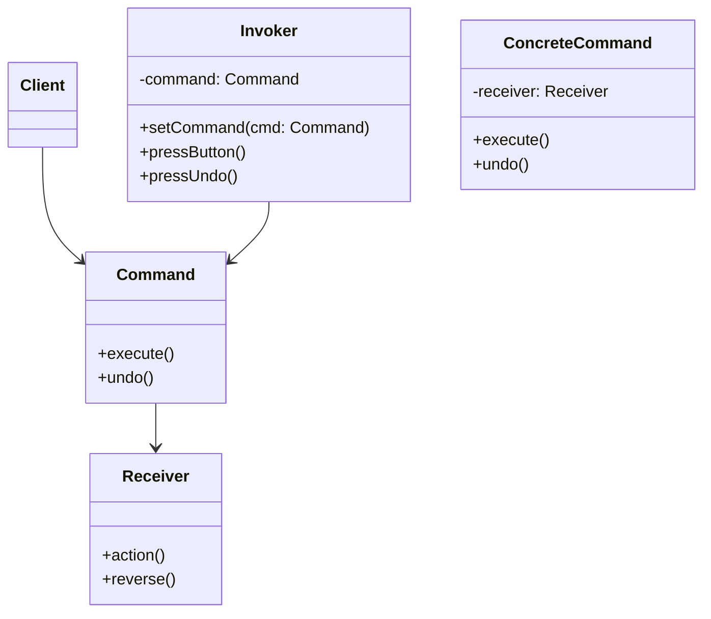

# 🍔 Command Pattern (요청을 객체로 캡슐화하라)

“실행해야 할 요청을 객체로 묶어 저장하고, 전달하고, 나중에 실행하거나 되돌릴 수 있도록 만들자.”

이 문서는 **Head First Design Patterns – Command 패턴 챕터**를 기반으로,
커맨드 패턴을 직접 설명하고 예제를 코드로 구성한 정리 문서입니다.

**요청을 함수 호출이 아닌 객체로 다루면 무엇이 달라지는가?**
Undo, 큐 처리, 매크로 실행, 장애 복구 등을 가능하게 하는 패턴의 근본 의도를 설명합니다.

---


# 1. 왜 Command 패턴이 필요한가?

보통 우리는 이렇게 동작을 호출합니다:

```java
light.on();
```

이 방식은 지금 당장은 문제가 없지만
애플리케이션 요구가 커지면 **심각한 결합도 문제가 발생합니다.**

✔ 실행 시점을 바꾸고 싶으면?
✔ 동작을 저장했다가 나중에 실행하고 싶으면?
✔ 취소(undo)를 구현해야 하면?
✔ 수행한 동작을 로그에 기록했다가 시스템 장애 후 재처리하고 싶으면?
✔ UI 버튼 100개가 각기 다른 시스템 동작을 트리거한다면?

함수 호출만으로는 불가능합니다.

> 그래서 우리는 **동작을 객체로 캡슐화**해야 합니다.

```java
Command turnOn = new LightOnCommand(light); // 요청을 객체로 저장
turnOn.execute();                            // 나중에 실행 가능
```

이 요구에서 등장한 패턴이 **Command Pattern**입니다.

---

# 2. 핵심 개념

Command 패턴은 다음을 가능하게 합니다:

* 요청을 객체로 표현한다.
* 요청을 저장하고 전달할 수 있다.
* 요청을 실행하는 객체(Receiver)와 요청을 만드는 객체(Client)를 분리한다.
* 실행 취소, 매크로 명령, 큐 처리, 트랜잭션 유사 기능을 자연스럽게 지원한다.

구조:

```
Client → Command → Invoker → Receiver
```
---

# 3. 식당 비유로 이해하기

| 역할  | 패턴 역할    |
| --- | -------- |
| 손님  | Client   |
| 주문서 | Command  |
| 종업원 | Invoker  |
| 요리사 | Receiver |

✔ 손님은 주문서를 작성한다.
✔ 종업원은 주문서가 뭔지 몰라도 전달만 한다.
✔ 요리사는 주문 내용을 보고 수행한다.

즉:

> **요청하는 객체와 수행하는 객체의 결합을 깨고, 요청을 객체로 전달 가능한 메시지로 만든다.**

---

# 4. Command 패턴 구조 요약



---

# 5. Java 구현 예제

## 5-1. Command 인터페이스

```java
public interface Command {
    void execute();
    void undo();
}
```

---

## 5-2. Receiver

```java
public class Light {

    public void on() {
        System.out.println("Light turned ON");
    }

    public void off() {
        System.out.println("Light turned OFF");
    }
}
```

---

## 5-3. Concrete Command들

```java
public class LightOnCommand implements Command {

    private final Light light;

    public LightOnCommand(Light light) {
        this.light = light;
    }

    @Override
    public void execute() {
        light.on();
    }

    @Override
    public void undo() {
        light.off();
    }
}

public class LightOffCommand implements Command {

    private final Light light;

    public LightOffCommand(Light light) {
        this.light = light;
    }

    @Override
    public void execute() {
        light.off();
    }

    @Override
    public void undo() {
        light.on();
    }
}
```

---

## 5-4. Invoker (Remote Control)

```java
public class RemoteControl {

    private Command slot;
    private Command lastCommand;

    public void setCommand(Command command) {
        this.slot = command;
    }

    public void pressButton() {
        slot.execute();
        lastCommand = slot;
    }

    public void pressUndo() {
        if (lastCommand != null) {
            lastCommand.undo();
        }
    }
}
```

---

## 5-5. Client 사용 예

```java
public class Client {

    public static void main(String[] args) {
        Light livingRoomLight = new Light();

        Command lightOn = new LightOnCommand(livingRoomLight);
        Command lightOff = new LightOffCommand(livingRoomLight);

        RemoteControl remote = new RemoteControl();

        remote.setCommand(lightOn);
        remote.pressButton();

        remote.setCommand(lightOff);
        remote.pressButton();

        remote.pressUndo(); // 바로 전 동작 복구
    }
}
```
---

# 6. 확장 기능 — Macro Command (여러 명령 묶기)

```java
public class MacroCommand implements Command {

    private final Command[] commands;

    public MacroCommand(Command[] commands) {
        this.commands = commands;
    }

    @Override
    public void execute() {
        for (Command cmd : commands) {
            cmd.execute();
        }
    }

    @Override
    public void undo() {
        for (int i = commands.length - 1; i >= 0; i--) {
            commands[i].undo();
        }
    }
}
```

---

# 7. Undo / 장애 복구 / 로그 기반 처리의 의미

네가 말한 것처럼 이 패턴은 실제로:

✔ **작업 로그 저장 → 장애 이후 재실행**
✔ 특정 시점까지의 Command를 순차 실행
✔ 반대로 실행해서 상태 복구

가 가능하다.

> 단, 실제 시스템에서는 직렬화/환경 의존성 때문에 쉽지 않다.
> 그 통찰은 아주 정확했다 — Undo는 단순한 반대 실행이 아니라 **상태 복구 설계의 문제**다.

---

# 8. 실무에서 언제 쓰는가?

* UI 버튼/메뉴 액션
* 배치/이벤트 처리
* 메시지 큐(Task Queue) 처리
* Undo/Redo 기능 구현
* 트랜잭션 처리 유사 로직

---

# 9. Command 패턴 한 줄 정리

> “요청을 객체로 포장해 실행 시점·방법을 유연하게 만들고, Undo/Queue/Macro 실행 같은 고급 흐름을 가능하게 한다.”

---


# ✔️ 마무리

Command 패턴은

* 캡슐화
* 느슨한 결합
* 실행 시점 분리
* 행동을 데이터처럼 다루는 설계

라는 객체지향 핵심 원리를 잘 보여주는 패턴이다.

요청사항을 객체로 만들 캡슐화 하여 매게 변수로 사용이 가능하고 
요청과 처리 분리한다.

실무에서 UI, 배치 처리, 작업 로그/복구 시스템에서도 자연스럽게 등장한다.

---
