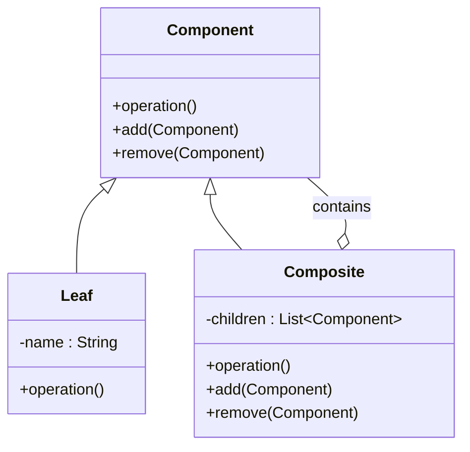

# 📌 Composite Pattern

> 👉 부분-전체(Part-Whole) 구조를 트리 형태로 구성하여, 개별 객체와 복합 객체를 동일한 방식으로 처리할 수 있는 패턴

---

## 📝 개요

이 문서는 **Composite** 패턴을 정리한 문서입니다.
해당 패턴의 개념, 등장 배경, 해결하는 문제, 코드 예제, 구조(UML), 실무 사용 포인트 등을 종합적으로 정리합니다.

- **분류**: 구조(Structural)
- **난이도**: ⭐⭐
- **참고**: Head First Design Patterns, Chapter 9

---

## 📚 핵심 요약

- 트리 구조를 기반으로 **부분과 전체를 동일하게 처리**
- `Leaf`(개별 객체)와 `Composite`(복합 객체)를 **동일 인터페이스**로 다룸
- **투명성(Transparency) vs 안정성(Safety)** 설계 트레이드오프 존재
- 💡 실무 인사이트: 구조가 커질 경우 **캐싱, 순서 관리, 성능** 고려 필수

---

## 1️⃣ 개념 정리

### ■ 배경

> 객체를 트리 구조로 표현해야 하는 상황에서 개별 객체와 복합 객체를 구분하여 처리하면 코드가 복잡해진다.

- 파일 시스템, 조직도, UI 컴포넌트처럼 **계층 구조가 자연스럽게 생기는 도메인**이 많음
- 기존 방식은 Leaf/Composite를 별도로 처리해야 했고, 클라이언트 코드에 타입 분기가 누적됨

### ■ 이론적 문제 상황

> 패턴을 적용하지 않으면 **설계 차원**에서 발생하는 문제들을 정리합니다.

- 문제 1: 개별 객체와 그룹 객체를 따로 처리해야 하므로 `if/instanceof` 분기가 증가
- 문제 2: 구조가 변경되면 클라이언트 코드도 함께 수정해야 하는 강한 결합 발생
- 문제 3: 재귀적 구조를 직접 구현할 경우 확장 시 구조가 쉽게 깨짐

### ■ 왜 필요한가?

> Composite Pattern은 부분과 전체를 동일하게 처리할 수 있는 인터페이스를 제공한다.

- 클라이언트 코드에서 타입 구분 불필요 → **코드 단순화**
- 새로운 Leaf/Composite 추가 시 기존 코드 수정 없음 → **OCP 준수, 확장성 향상**
- 추상화(Component)에만 의존 → **클라이언트 의존성 감소**

### ■ 구조 / 흐름

> Component 인터페이스 정의 → Leaf/Composite 구현 → Composite가 Component 리스트를 재귀적으로 포함

1. `Component` 인터페이스에 공통 연산(`operation`) 정의
2. `Leaf`는 자식 없이 `operation()`만 구현
3. `Composite`는 `List<Component>`를 갖고 `operation()` 호출 시 자식에게 위임
4. 클라이언트는 `Component` 타입만 알고 Leaf/Composite를 구분하지 않음

```plaintext
Component (인터페이스)
 ├─ Leaf      (개별 객체, 자식 없음)
 └─ Composite (복합 객체, 자식 포함)
       ├─ Leaf
       └─ Composite
             └─ Leaf
```

### ■ 관련 디자인 원칙

| 원칙 | 적용 방식 |
|------|-----------|
| OCP (개방-폐쇄 원칙) | 새 Leaf/Composite 추가 시 기존 클라이언트 코드 수정 불필요 |
| DIP (의존 역전 원칙) | 클라이언트는 구체 클래스가 아닌 `Component` 추상화에 의존 |
| 캡슐화 | `children` 리스트는 Composite 내부에서만 관리 |
| SRP (단일 책임 원칙) | ⚠️ 투명성 설계 시 Leaf에 불필요한 메서드가 생겨 SRP가 약화될 수 있음 |

### ■ 간단 예시

> 파일 시스템을 떠올리면 이해하기 쉽다.

- **파일** → `Leaf` : 자식을 가질 수 없고, `print()`만 실행
- **폴더** → `Composite` : 내부에 파일 또는 다른 폴더를 포함하며, `print()` 시 자식들에게 재귀 호출
- 클라이언트는 파일이든 폴더든 `component.print()` 한 줄로 처리 가능

---

## 2️⃣ 예제 코드

### ✔ UML 다이어그램 (구조 요약)

UML 클래스 다이어그램 기호 표:

| 기호 | 의미 | Java 접근 제어자 |
|------|------|----------------|
| `+` | public | public |
| `-` | private | private |
| `#` | protected | protected |
| `~` | package | default (package-private) |



---

### ✔ 구현 예제 1 — Component 인터페이스 (공통 추상화)

```java
// Component: Leaf와 Composite가 공유하는 공통 인터페이스
// add/remove에 default 예외를 두어 Leaf가 구현하지 않아도 되도록 설계 (투명성 방식)
interface Component {
    void operation();

    default void add(Component component) {
        throw new UnsupportedOperationException("이 컴포넌트는 자식을 가질 수 없습니다.");
    }

    default void remove(Component component) {
        throw new UnsupportedOperationException("이 컴포넌트는 자식을 가질 수 없습니다.");
    }
}
```

### ✔ 구현 예제 2 — Leaf 클래스 (개별 객체)

```java
// Leaf: 자식을 갖지 않는 말단 객체
// operation()만 구현하며, add/remove는 부모의 default 예외를 그대로 사용
class Leaf implements Component {

    private final String name;

    public Leaf(String name) {
        this.name = name;
    }

    @Override
    public void operation() {
        System.out.println("Leaf: " + name);
    }
}
```

### ✔ 구현 예제 3 — Composite 클래스 + 클라이언트 사용 예시

```java
import java.util.ArrayList;
import java.util.List;

// Composite: 자식(Component)을 포함하는 복합 객체
// operation() 호출 시 children에게 재귀적으로 위임
class Composite implements Component {

    private final List<Component> children = new ArrayList<>();

    @Override
    public void operation() {
        for (Component child : children) {
            child.operation();
        }
    }

    @Override
    public void add(Component component) {
        children.add(component);
    }

    @Override
    public void remove(Component component) {
        children.remove(component);
    }
}

// 클라이언트 코드: Leaf/Composite 구분 없이 동일하게 사용
class Client {
    public static void main(String[] args) {
        Component root = new Composite();       // 루트 폴더

        Component sub = new Composite();        // 하위 폴더
        sub.add(new Leaf("파일A"));
        sub.add(new Leaf("파일B"));

        root.add(new Leaf("파일C"));
        root.add(sub);

        root.operation();
        // 출력:
        // Leaf: 파일C
        // Leaf: 파일A
        // Leaf: 파일B
    }
}
```

---

## 3️⃣ 실무 포인트

### ✔ 언제 사용하면 좋은가?

- 상황 1: **트리 구조 데이터**를 처리해야 할 때 (조직도, 메뉴, 파일 시스템, 카테고리)
- 상황 2: 전체와 부분을 **동일한 방식으로 다뤄야** 할 때
- 상황 3: 클라이언트 코드에서 **타입 분기(instanceof)를 제거**하고 싶을 때

### ✔ 실제 코드에서 해결되는 문제

> 이론적 문제(1️⃣ 섹션)와 달리, **코드 레벨**에서 이 패턴이 실제로 해소하는 문제를 정리합니다.

- 문제 해결 1: `if (obj instanceof Leaf)` 같은 타입 분기 코드 제거 → `component.operation()` 한 줄로 통일
- 문제 해결 2: 새로운 컴포넌트 타입 추가 시 클라이언트 코드 수정 불필요
- 문제 해결 3: 재귀 호출 구조를 패턴 내부에 캡슐화하여 클라이언트가 트리 구조를 직접 순회하지 않아도 됨

### ✔ 잘못 적용하면 생길 문제

- 문제점 1: `Leaf`에 `add/remove` 같은 **의미 없는 메서드가 강제**되어 SRP 약화 (투명성 설계의 트레이드오프)
- 문제점 2: 계층이 깊어질수록 **재귀 호출 성능 저하** — 트리 깊이 통제 또는 캐싱 필요
- 문제점 3: `children` 간 **순환 참조** 발생 시 무한 루프 위험

### ✔ 실무에서 자주 발생하는 이슈

| 이슈 | 원인 | 해결 방법 |
|------|------|-----------|
| 성능 저하 | 트리 깊이가 깊어질 경우 재귀 연산 누적 | 결과 캐싱(Caching) 적용 |
| 순서 문제 | `children` 순서에 따라 `operation()` 결과가 달라짐 | 명시적 정렬/순서 관리 전략 수립 |
| 메모리/참조 | 대규모 트리에서 `children` 참조 관리 부담 | 순환 참조 방지 로직, WeakReference 검토 |
| 인터페이스 설계 | 투명성 vs 안정성 선택 문제 | 아래 표 참고 |

**투명성 vs 안정성 설계 비교**:

| 방식 | 특징 | 장점 | 단점 |
|------|------|------|------|
| 투명성 (Transparency) | Leaf/Composite 동일 인터페이스 | 클라이언트 코드 단순 | Leaf에 의미 없는 메서드 강제 |
| 안정성 (Safety) | 인터페이스 분리, 타입 체크 필요 | Leaf 책임 명확 | 클라이언트에 타입 분기 발생 |

### ✔ 프레임워크에서의 활용

| 프레임워크 | 활용 방식 |
|-----------|-----------|
| Spring | ApplicationContext가 Bean 정의 트리를 Composite 구조로 관리 |
| React / Swing | UI 컴포넌트 트리 — 부모/자식 컴포넌트를 동일 인터페이스로 렌더링 |
| Java IO | `File` 클래스 — 파일과 디렉토리를 동일한 API로 다룸 |

---

## ⚠️ 안 썼을 때 문제 — 언제 깨지는가

- **시나리오 1**: 파일/폴더를 별도 클래스로 관리하면 → 클라이언트에서 `instanceof` 분기가 증가하고, 새로운 타입 추가마다 분기 추가 필요
- **시나리오 2**: 조직도에서 팀장/팀원을 따로 처리하면 → "전체 조직 출력" 같은 기능을 구현할 때 타입별로 별도 로직 작성 필요
- **시나리오 3**: 깊이 제한 없는 카테고리 구조에서 패턴 없이 구현하면 → 뎁스가 늘어날 때마다 코드 수정 필요, 유지보수 불가

---

## 🔄 유사 패턴 비교

> 헷갈리기 쉬운 패턴과의 차이점을 명확히 정리합니다.

| 비교 대상 | 공통점 | 차이점 | 선택 기준 |
|-----------|--------|--------|-----------|
| Composite vs **Decorator** | 둘 다 Component를 재귀적으로 포함하는 트리 구조 | Decorator는 기능을 **동적으로 추가**, Composite는 **구조(트리) 자체**가 목적 | 기능 확장이 목적 → Decorator / 계층 구조 표현이 목적 → Composite |
| Composite vs **Iterator** | 트리 구조 순회와 함께 자주 사용됨 | Iterator는 순회 방법을 캡슐화, Composite는 트리 구조 자체를 표현 | 두 패턴은 **함께 사용**하는 것이 일반적 (Composite 구조를 Iterator로 순회) |
| Composite vs **Chain of Responsibility** | 둘 다 재귀적인 객체 연결 구조 | CoR는 요청이 **한 방향**으로 흐르며 처리자를 찾음, Composite는 **모든 자식에게 동시에 위임** | 요청 처리자를 찾는 것 → CoR / 전체 트리에 동일 연산 → Composite |

---

## 💬 면접에서 이렇게 말한다

> 면접관 질문: "Composite 패턴이 무엇인지 설명해 주세요."

**3줄 스크립트**:
1. "Composite 패턴은 부분-전체 계층 구조를 트리 형태로 구성하여, 개별 객체(Leaf)와 복합 객체(Composite)를 동일한 인터페이스로 처리할 수 있게 하는 구조 패턴입니다."
2. "핵심 원리는 Component라는 공통 인터페이스를 두고, Composite가 내부에 Component 리스트를 갖는 재귀 구조로 구현합니다."
3. "실무에서는 조직도, 파일 시스템, UI 컴포넌트 트리 등에 사용하며, 투명성과 안정성 사이의 트레이드오프와 성능 이슈를 주의해야 합니다."

> 꼬리 질문 대비:

- Q: "Leaf에 `add/remove`가 있으면 이상하지 않나요?" → A: "투명성 설계를 선택한 경우로, 클라이언트 코드를 단순화하는 장점이 있지만 SRP가 약화됩니다. 타입 안정성이 중요하다면 Leaf에서 메서드를 제거하는 안정성 설계를 선택합니다."
- Q: "트리 구조에서 성능 문제는 어떻게 해결하나요?" → A: "재귀 호출 결과를 캐싱하거나, 트리 깊이를 제한하는 방어 코드를 추가합니다. 순환 참조도 별도로 방지해야 합니다."
- Q: "Decorator 패턴과의 차이는?" → A: "둘 다 Component를 포함하는 구조지만, Decorator는 기능을 동적으로 추가하는 것이 목적이고, Composite는 트리 구조 자체의 표현이 목적입니다."

---

## ✅ 학습 확인 체크리스트

> 이 패턴을 진짜 이해했는지 스스로 점검해 보세요.

- [ ] Composite 패턴 없이 트리 구조를 구현하면 어떤 문제가 생기는지 설명할 수 있다
- [ ] UML 구조(Component / Leaf / Composite 관계)를 보지 않고 손으로 그릴 수 있다
- [ ] 투명성(Transparency)과 안정성(Safety) 설계의 차이를 설명할 수 있다
- [ ] Decorator 패턴과의 차이를 1분 안에 설명할 수 있다
- [ ] 면접 질문에 3줄 이내로 답할 수 있다
- [ ] 실무 이슈(성능, 순환 참조, children 순서)를 알고 있다

---

## 4️⃣ 정리

Composite 패턴은 파일 시스템, 조직도, UI 컴포넌트처럼 **부분-전체 계층 구조**가 자연스럽게 생기는 도메인에서 Leaf와 Composite를 동일한 인터페이스로 처리하기 위한 패턴이다. 핵심은 클라이언트가 타입을 구분하지 않고 `operation()` 하나로 전체 트리를 순회할 수 있다는 점이며, 이를 통해 `instanceof` 분기를 제거하고 확장성을 확보한다. 다만 투명성 설계를 선택할 경우 Leaf의 SRP가 약화되고, 트리 깊이가 깊어질수록 성능과 참조 구조 관리가 실무 핵심 과제가 된다.

**다음에 공부할 패턴**: `Iterator` → Composite 구조를 순회할 때 자연스럽게 함께 사용되며, 두 패턴의 조합이 면접에서 자주 나오는 주제

**관련 문서**:
- [Iterator Pattern 노트](#)
- [Decorator Pattern 노트](#)
- [Chain of Responsibility Pattern 노트](#)
