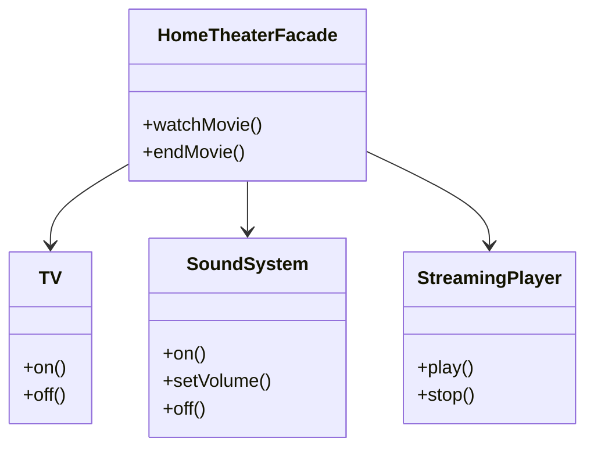

# 📌 퍼사드 패턴(Facade Pattern)

> **퍼사드 패턴(Facade Pattern)**
> 👉 복잡한 서브시스템을 하나의 단순한 진입점으로 감싸 사용하는 구조 패턴

## 📝 개요

이 문서는 **퍼사드(Facade) 패턴**을 정리한 문서입니다.
퍼사드 패턴의 개념, 등장 배경, 해결하는 문제, 구조(UML), 코드 예제,
그리고 실무에서 언제 사용하면 좋은지까지 종합적으로 정리합니다.

## 📚 핵심 요약

* 퍼사드 패턴은 **복잡한 서브시스템을 단순한 인터페이스(진입점)로 감싼다**
* 클라이언트는 서브시스템의 내부 구조를 몰라도 된다
* 변경 영향 범위를 퍼사드 내부로 제한할 수 있다
* (실무 인사이트) **퍼사드는 “편의성 + 결합도 감소”를 동시에 노린다**

## 1️⃣ 개념 정리

### ■ 배경

대규모 시스템에서는 여러 객체와 서브시스템이 서로 복잡하게 얽혀
클라이언트 코드가 특정 구현에 강하게 의존하게 되는 문제가 발생합니다.

이러한 상황에서는

* 사용법이 복잡해지고
* 수정 시 영향 범위가 넓어지며
* 유지보수가 어려워집니다.

이를 해결하기 위해 **퍼사드 패턴**이 등장했습니다.

### ■ 문제 상황

퍼사드 패턴을 적용하지 않으면 다음과 같은 문제가 발생합니다.

* 클라이언트가 여러 서브시스템 객체를 직접 제어해야 함
* 호출 순서와 내부 동작을 클라이언트가 모두 알아야 함
* 서브시스템 변경 시 클라이언트 코드까지 수정 필요
* 코드 가독성과 유지보수성 저하

### ■ 왜 필요한가?

퍼사드 패턴은 다음을 해결합니다.

* **복잡한 사용 절차를 단순화**
* **클라이언트와 서브시스템 간 결합도 감소**
* **변경에 강한 구조 제공**
* **고수준 API 제공으로 사용성 개선**

### ■ 구조/흐름

1. 클라이언트는 퍼사드 객체만 사용
2. 퍼사드는 내부적으로 여러 서브시스템 객체를 구성(Composition)
3. 퍼사드의 메서드 하나가 여러 서브시스템 동작을 순차적으로 실행
4. 서브시스템 변경 시 퍼사드만 수정

### ■ 관련 디자인 원칙

* **캡슐화(Encapsulation)**
  → 내부 구조를 숨기고 필요한 기능만 노출

* **DIP (의존성 역전 원칙)**
  → 클라이언트는 구체 구현이 아닌 고수준 인터페이스(퍼사드)에 의존

* **LoD (최소 지식의 원칙)**
  → 클라이언트는 필요한 객체와만 상호작용


### ■ 간단 예시

홈시어터 시스템이 있다고 가정:

* TV 전원 켜기
* 화면 모드 설정
* 사운드 시스템 켜기
* 볼륨 설정
* 스트리밍 시작

이 모든 과정을 클라이언트가 직접 호출하지 않고,

```java
facade.watchMovie();
```

한 줄로 처리할 수 있도록 만드는 것이 퍼사드 패턴이다.

## 2️⃣ 예제 코드

### ✔ UML 다이어그램 (구조 요약)



### ✔ 구현 예제 1 (서브시스템)

```java
public class TV {
    public void on() {
        System.out.println("TV 전원 ON");
    }

    public void off() {
        System.out.println("TV 전원 OFF");
    }
}
```

```java
public class SoundSystem {
    public void on() {
        System.out.println("사운드 시스템 ON");
    }

    public void setVolume(int level) {
        System.out.println("볼륨 설정: " + level);
    }

    public void off() {
        System.out.println("사운드 시스템 OFF");
    }
}
```

```java
public class StreamingPlayer {
    public void play() {
        System.out.println("영화 스트리밍 시작");
    }

    public void stop() {
        System.out.println("영화 스트리밍 종료");
    }
}
```

### ✔ 구현 예제 2 (퍼사드)

```java
public class HomeTheaterFacade {

    private TV tv;
    private SoundSystem soundSystem;
    private StreamingPlayer player;

    public HomeTheaterFacade(TV tv, SoundSystem soundSystem, StreamingPlayer player) {
        this.tv = tv;
        this.soundSystem = soundSystem;
        this.player = player;
    }

    public void watchMovie() {
        tv.on();
        soundSystem.on();
        soundSystem.setVolume(10);
        player.play();
    }

    public void endMovie() {
        player.stop();
        soundSystem.off();
        tv.off();
    }
}
```

## 3️⃣ 실무 포인트

### ✔ 언제 사용하면 좋은가?

* 여러 서브시스템을 **정해진 순서로 함께 사용해야 할 때**
* 클라이언트가 내부 구현을 알 필요가 없을 때
* API 사용성을 단순화하고 싶을 때

### ✔ 해결하는 문제

* 복잡한 객체 협력 구조 은닉
* 클라이언트 코드의 결합도 감소
* 변경 영향 범위 최소화

### ✔ 잘못 적용하면 생길 문제

* 퍼사드가 너무 비대해질 수 있음
* 모든 책임이 퍼사드에 몰릴 위험
* 단순 위임 객체로 전락 가능

### ✔ 실무에서 자주 발생하는 이슈

* 퍼사드가 God Object가 되지 않도록 주의
* 여러 퍼사드를 용도별로 분리하는 전략 필요

### ✔ 프레임워크에서의 활용 (선택)

* **Spring**
  → Service 계층이 퍼사드 역할을 수행하는 경우가 많음
* **Spring Boot**
  → Controller → Service 구조 자체가 퍼사드 개념을 내포

## ⚠️ 안 썼을 때 문제

* 클라이언트가 서브시스템 내부 구조에 강하게 의존
* 수정 시 여러 클래스에 영향
* 테스트 및 유지보수 난이도 증가

## 💬 면접에서 이렇게 말한다

> “퍼사드 패턴은 복잡한 서브시스템을 하나의 고수준 진입점으로 감싸
> 클라이언트 사용성을 단순화하고 결합도를 낮추기 위한 패턴입니다.
> 내부 구현이 변경되더라도 클라이언트에는 영향을 주지 않는 구조를 만듭니다.”

## 4️⃣ 정리

퍼사드 패턴은 복잡한 시스템을 단순하게 사용하는 **구조 패턴**으로,
클라이언트와 서브시스템 간의 결합도를 낮추고 변경에 강한 구조를 제공합니다.
실무에서는 서비스 계층이나 API 설계에서 자연스럽게 활용되며,
과도하게 비대해지지 않도록 책임 범위를 명확히 하는 것이 중요합니다.
