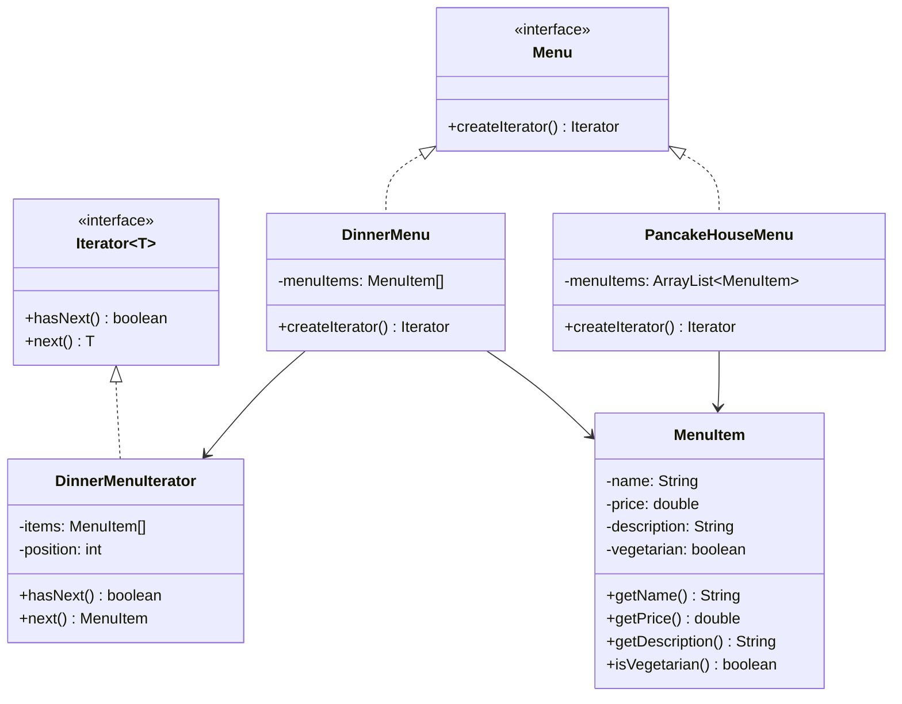

---

# 📌 반복자 패턴 (Iterator Pattern)

> 👉 내부 구현을 노출하지 않고, 동일한 방식으로 순회할 수 있도록 해주는 패턴

## 📝 개요

이 문서는 **Iterator Pattern(반복자 패턴)** 을 정리한 문서입니다.
해당 패턴의 개념, 등장 배경, 해결하는 문제, 코드 예제, 구조(UML), 실무 사용 포인트 등을 종합적으로 정리합니다.

Iterator 패턴은 집합 객체(Aggregate) 또는 컬렉션 내부 구조(ArrayList, HashMap 등)를 외부에 노출하지 않으면서도,
클라이언트가 **동일한 순회 방식**으로 요소에 접근할 수 있도록 해주는 행위(Behavioral) 패턴입니다.

Java에서는 `Iterator`, `Iterable`, 향상된 for문, Stream API 등과 연결되어 매우 중요한 기초 패턴이며,
단순히 "반복"을 위한 기술이 아니라 **캡슐화, 단일 책임 원칙(SRP), 다형성, 의존성 감소**와 밀접하게 연결되는 설계 패턴입니다.

---

## 📚 핵심 요약

* Iterator 패턴은 **집합 객체(Aggregate) 또는 컬렉션의 내부 표현을 노출하지 않고도 순차 접근을 가능하게 한다.**
* 서로 다른 자료구조(Array, ArrayList, HashMap 등)를 **동일한 인터페이스로 순회**할 수 있다.
* 관리 책임과 순회 책임을 분리하여 **SRP(단일 책임 원칙)** 를 만족시키는 데 도움을 준다.
* 클라이언트는 구체 타입이 아니라 **Iterator 인터페이스에 의존**하게 된다.
* Java에서는 이미 컬렉션 프레임워크가 Iterator 패턴을 내장하고 있으므로, 실무에서는 직접 구현보다 **내장된 Iterator를 활용하는 경우가 대부분**이다.

---

## 1️⃣ 개념 정리

### ■ 배경

서로 다른 방식으로 데이터를 저장하는 집합 객체(Aggregate) 또는 컬렉션이 존재할 때, 클라이언트가 각 컬렉션의 내부 구조를 직접 알고 순회해야 한다면 코드가 복잡해지고 결합도가 높아집니다.

예를 들어 한 식당의 메뉴는 `ArrayList`로 관리하고, 다른 식당의 메뉴는 고정 크기 `Array`로 관리한다고 가정해보겠습니다.

이 경우 메뉴를 출력하는 클라이언트는 다음과 같은 문제를 겪게 됩니다.

* `ArrayList`는 `size()`와 `get(index)`를 사용해야 한다.
* `Array`는 `length`와 인덱스 접근을 사용해야 한다.

즉, **컬렉션이 바뀌거나 데이터 타입이 다른 경우 순회 코드도 함께 수정**되어야 합니다.
이 문제를 해결하기 위해 등장한 것이 Iterator 패턴입니다.

---

### ■ 문제 상황

패턴을 적용하지 않으면 보통 다음과 같은 문제가 발생합니다.

1. **클라이언트가 컬렉션 내부 구조를 알아야 한다.**
   `ArrayList`인지, `Array`인지, `HashMap`인지에 따라 순회 방식이 달라진다.

2. **순회 코드가 중복된다.**
   자료구조가 여러 개면 `for`문, `while`문, null 체크, size 체크 로직이 반복된다.

3. **변경에 취약하다.**
   컬렉션 구조가 `Array`에서 `ArrayList`로 바뀌면 클라이언트 코드도 수정해야 한다.

4. **캡슐화가 깨진다.**
   클라이언트가 내부 저장 구조를 알고 있다는 것은 구현 세부사항이 외부에 노출된 상태다.

5. **책임 분리가 안 된다.**
   메뉴를 보관하는 책임과 메뉴를 순회하는 책임이 한 클래스에 섞이게 된다.

---

### ■ 왜 필요한가?

Iterator 패턴은 다음과 같은 문제를 해결합니다.

* **내부 구조를 숨긴다.**
* **순회 로직을 표준화한다.**
* **클라이언트가 구체 컬렉션 타입 및 다른 데이터 타입에 의존하지 않게 만든다.**
* **순회 책임을 별도 객체로 분리하여 응집도를 높인다.**
* **동일한 순회 인터페이스를 통해 다형성을 확보한다.**

즉, Iterator 패턴의 핵심은 단순히 "반복하기 편하게 만든다"가 아니라,

> **내부 구현은 숨기고, 외부에는 일관된 접근 방식만 제공한다**

는 점입니다.

---

### ■ 구조/흐름

전체 흐름은 다음과 같습니다.

1. 각 집합 객체(Aggregate) (예: `DinnerMenu`, `PancakeHouseMenu`)는 내부적으로 서로 다른 저장 구조를 가질 수 있다.
2. 클라이언트는 각 집합 객체(Aggregate) 내부 구조를 직접 알지 않는다.
3. 각 집합 객체(Aggregate)는 `createIterator()` 또는 `iterator()` 같은 메서드를 통해 반복자를 생성한다.
4. 반복자는 `hasNext()`, `next()` 등의 메서드를 통해 순회를 담당한다.
5. 클라이언트는 클래스의 구현이 아니라 `Iterator` 인터페이스에만 의존하여 동일한 방식으로 요소를 처리한다.

즉,

**집합 객체(Aggregate) 관리 책임**과 **순회 책임**을 분리하고,
클라이언트는 오직 **반복자 인터페이스만 알면 되는 구조**가 됩니다.

---

### ■ 관련 디자인 원칙

* **캡슐화(Encapsulation)**
   내부 저장 구조를 외부에 노출하지 않는다.

* **단일 책임 원칙(SRP)**
  객체는 데이터를 저장/관리하는 책임을 가지고, 반복자는 순회 책임을 가진다.

* **의존성 역전 원칙(DIP)**
  클라이언트는 구체 클래스가 아니라 `Iterator` 인터페이스에 의존한다.

* **프로그래밍은 구현이 아닌 인터페이스에 맞춰서 하라**
  `Array`, `ArrayList`, `HashMap`이 아니라 `Iterator`라는 추상화에 맞춰 코드를 작성한다.

* **최소 지식 원칙(Law of Demeter)**
  클라이언트가 내부 컬렉션 구조를 직접 탐색하지 않고, 필요한 기능만 제공받는다.

---

### ■ 간단 예시

두 개의 식당 메뉴가 있다고 가정합니다.

* `PancakeHouseMenu`는 `ArrayList<MenuItem>` 사용
* `DinnerMenu`는 `MenuItem[]` 사용

패턴을 적용하지 않으면 메뉴를 출력하는 쪽에서 각각 다른 방식으로 접근해야 합니다.

```java
for (int i = 0; i < dinnerMenuItems.length; i++) {
    // 배열 순회
}

for (int i = 0; i < pancakeMenuItems.size(); i++) {
    // 리스트 순회
}
```

Iterator 패턴을 적용하면 다음처럼 통일됩니다.

```java
Iterator<MenuItem> iterator = menu.createIterator();
while (iterator.hasNext()) {
    MenuItem item = iterator.next();
    System.out.println(item.getName());
}
```

클라이언트는 더 이상 내부 저장 방식이 배열인지 리스트인지 알 필요가 없습니다.

---

## 2️⃣ 예제 코드

### ✔ UML 다이어그램 (구조 요약)

UML 클래스 다이어그램에서 사용하는 기호는 다음과 같습니다:

| 기호  | 의미        | Java 접근 제어자              |
| --- | --------- | ------------------------ |
| `+` | public    | public                   |
| `-` | private   | private                  |
| `#` | protected | protected                |
| `~` | package   | default(package-private) |

필요 시 Mermaid를 사용해 UML을 그립니다.



---

### ✔ 구현 예제 1

#### 1. 메뉴 항목 클래스

```java
public class MenuItem {
    private String name;
    private double price;
    private String description;
    private boolean vegetarian;

    public MenuItem(String name, double price, String description, boolean vegetarian) {
        this.name = name;
        this.price = price;
        this.description = description;
        this.vegetarian = vegetarian;
    }

    public String getName() {
        return name;
    }

    public double getPrice() {
        return price;
    }

    public String getDescription() {
        return description;
    }

    public boolean isVegetarian() {
        return vegetarian;
    }
}
```

---

### ✔ 구현 예제 2

#### 2. Menu 인터페이스

```java
import java.util.Iterator;

public interface Menu {
    Iterator<MenuItem> createIterator();
}
```

이 인터페이스의 핵심은 각 메뉴 구현체가 자신의 내부 구조와 무관하게
반복자를 생성하는 기능을 반드시 제공하도록 강제하는 것입니다.

클라이언트는 `Menu` 타입만 알고 있어도 됩니다.

---

### ✔ 구현 예제 3

#### 3. ArrayList 기반 메뉴 구현체

```java
import java.util.ArrayList;
import java.util.Iterator;
import java.util.List;

public class PancakeHouseMenu implements Menu {
    private List<MenuItem> menuItems = new ArrayList<>();

    public PancakeHouseMenu() {
        addItem("팬케이크 세트", 5.99, "스크램블 에그와 토스트 포함", true);
        addItem("와플 세트", 6.99, "블루베리 와플", true);
    }

    public void addItem(String name, double price, String description, boolean vegetarian) {
        menuItems.add(new MenuItem(name, price, description, vegetarian));
    }

    @Override
    public Iterator<MenuItem> createIterator() {
        return menuItems.iterator();
    }
}
```

여기서는 `ArrayList`가 Java에서 제공하는 `iterator()`를 이미 가지고 있으므로
별도의 Iterator 구현 없이 내장 기능을 그대로 사용합니다.

---

### ✔ 구현 예제 4

#### 4. Array 기반 메뉴 구현체

```java
import java.util.Iterator;

public class DinnerMenu implements Menu {
    private static final int MAX_ITEMS = 6;
    private MenuItem[] menuItems;
    private int numberOfItems = 0;

    public DinnerMenu() {
        menuItems = new MenuItem[MAX_ITEMS];
        addItem("채식 BLT", 4.99, "채식 재료가 들어간 BLT", true);
        addItem("오늘의 스프", 3.99, "따뜻한 스프", true);
    }

    public void addItem(String name, double price, String description, boolean vegetarian) {
        if (numberOfItems >= MAX_ITEMS) {
            throw new IllegalStateException("메뉴가 가득 찼습니다.");
        }
        menuItems[numberOfItems++] = new MenuItem(name, price, description, vegetarian);
    }

    @Override
    public Iterator<MenuItem> createIterator() {
        return new DinnerMenuIterator(menuItems);
    }
}
```

배열은 Java Collection이 아니므로 `iterator()`를 기본 제공하지 않습니다.
따라서 배열을 순회하려면 직접 Iterator를 구현해야 합니다.

---

### ✔ 구현 예제 5

#### 5. Array 전용 Iterator 구현

```java
import java.util.Iterator;
import java.util.NoSuchElementException;

public class DinnerMenuIterator implements Iterator<MenuItem> {
    private MenuItem[] items;
    private int position = 0;

    public DinnerMenuIterator(MenuItem[] items) {
        this.items = items;
    }

    @Override
    public boolean hasNext() {
        return position < items.length && items[position] != null;
    }

    @Override
    public MenuItem next() {
        if (!hasNext()) {
            throw new NoSuchElementException();
        }
        return items[position++];
    }
}
```

여기서 반복자의 책임은 오직 순회입니다.

* 현재 위치를 관리한다.
* 다음 요소가 존재하는지 판단한다.
* 다음 요소를 반환한다.

즉, **컬렉션 저장 책임과 순회 책임이 분리**됩니다.

---

### ✔ 구현 예제 6

#### 6. 클라이언트 코드

```java
import java.util.Iterator;

public class Waitress {
    public void printMenu(Menu menu) {
        Iterator<MenuItem> iterator = menu.createIterator();

        while (iterator.hasNext()) {
            MenuItem item = iterator.next();
            System.out.println(item.getName() + " / " + item.getPrice());
            System.out.println(item.getDescription());
        }
    }
}
```

이 코드의 핵심은 클라이언트가 `DinnerMenu`, `PancakeHouseMenu`의 내부 자료구조를 전혀 모른다는 점입니다.
오직 `Menu`와 `Iterator`만 알고 동일한 방식으로 순회합니다.

---

### ✔ 구현 예제 7 (HashMap 활용 시)

HashMap은 `Map` 계열이기 때문에 순회 방식이 약간 다릅니다.

```java
import java.util.HashMap;
import java.util.Iterator;
import java.util.Map;

public class CafeMenu {
    private Map<String, MenuItem> menuItems = new HashMap<>();

    public CafeMenu() {
        menuItems.put("아메리카노", new MenuItem("아메리카노", 3.5, "기본 커피", true));
        menuItems.put("카페라떼", new MenuItem("카페라떼", 4.0, "우유가 들어간 커피", true));
    }

    public Iterator<MenuItem> createIterator() {
        return menuItems.values().iterator();
    }
}
```

여기서 주의할 점은 `map.values().iterator()`처럼 내부 구조를 노출하는 체이닝이 과도해지면
최소 지식 원칙 측면에서 좋지 않을 수 있다는 점입니다.

이를 감추기 위해 아예 `createIterator()` 내부에서 처리하고 외부에는 Iterator만 제공하는 것이 더 바람직합니다.

---

## 3️⃣ 실무 포인트

### ✔ 언제 사용하면 좋은가?

* 서로 다른 컬렉션 구조를 **동일한 방식으로 순회**해야 할 때
* 내부 자료구조를 외부에 노출하지 않고 싶을 때
* 순회 책임을 컬렉션 객체에서 분리하고 싶을 때
* 다형성을 활용해 클라이언트 코드 변경 없이 새로운 컬렉션 구현체를 추가하고 싶을 때
* 트리, 그래프, 커스텀 자료구조 등의 순회 로직을 추상화해야 할 때

---

### ✔ 해결하는 문제

* 자료구조별로 달라지는 순회 코드 문제
* 컬렉션 내부 구조 노출 문제
* 순회 로직 중복 문제
* 컬렉션 변경 시 클라이언트 코드까지 수정해야 하는 문제
* 컬렉션 클래스가 저장 책임과 순회 책임을 동시에 갖는 문제

---

### ✔ 잘못 적용하면 생길 문제

* Java 컬렉션이 이미 Iterator를 제공하는데 불필요하게 직접 구현하면 코드가 과도하게 복잡해질 수 있다.
* 단순한 구조인데도 Iterator 클래스를 별도로 많이 만들면 오히려 가독성이 떨어질 수 있다.
* 컬렉션 구조가 단순하고 변경 가능성이 거의 없는데 패턴을 남발하면 과설계가 된다.
* 내부 반복(Stream, forEach)이 더 적합한 상황에서도 무조건 외부 반복자를 고집하면 코드가 장황해질 수 있다.

---

### ✔ 실무에서 자주 발생하는 이슈

#### 1. Java에서는 직접 구현보다 내장 Iterator 사용이 일반적이다

실무에서는 `ArrayList`, `Set`, `Queue` 등 대부분의 컬렉션이 이미 Iterator를 제공하므로
디자인패턴 책처럼 직접 `Iterator` 구현체를 만드는 경우는 많지 않습니다.

즉, **Iterator 패턴을 안 쓰는 것이 아니라 이미 쓰고 있는 것**에 가깝습니다.

예를 들어 향상된 for문은 내부적으로 Iterator 기반입니다.

```java
for (MenuItem item : menuItems) {
    System.out.println(item.getName());
}
```

위 코드는 내부적으로 `iterator()`를 사용합니다.

---

#### 2. 외부 반복자와 내부 반복자의 차이

Iterator는 대표적인 **외부 반복자(External Iterator)** 입니다.
즉, 클라이언트가 직접 반복 과정을 제어합니다.

반면 `forEach`, Stream API는 **내부 반복자(Internal Iterator)** 성격이 강합니다.

```java
menuItems.forEach(item -> System.out.println(item.getName()));
```

이 경우 반복 제어는 컬렉션/프레임워크 쪽이 담당합니다.

---

#### 3. Stream과의 차이

Iterator는 **순차 접근 인터페이스**에 가깝고,
Stream은 **데이터 처리 파이프라인**에 가깝습니다.

Iterator는 "어떻게 하나씩 꺼낼까"에 집중하고,
Stream은 "필터링, 변환, 집계, 병렬 처리 등을 어떻게 선언적으로 수행할까"에 더 가깝습니다.

---

### ✔ 프레임워크에서의 활용 (선택)

* **Java Collection Framework**
  `ArrayList`, `HashSet`, `LinkedList` 등 대부분의 컬렉션이 Iterator 제공

* **JPA / Hibernate**
  내부적으로 컬렉션 순회, 지연 로딩 컬렉션 관리 등에서 반복 개념 활용

* **Spring Framework**
  빈 목록, 리소스 목록, 메시지 처리 체인 등 다양한 곳에서 컬렉션 순회 기반 구조 사용

* **향상된 for문 / forEach / Stream API**
  Java 언어 차원에서 Iterator 패턴의 영향이 매우 큼

---

## ⚠️ 안 썼을 때 문제

* 컬렉션 종류가 바뀔 때마다 순회 코드가 함께 수정된다.
* 클라이언트가 내부 저장 구조를 알아야 해서 캡슐화가 깨진다.
* 자료구조별 `for`문이 중복되어 유지보수성이 떨어진다.
* 저장 책임과 순회 책임이 하나의 클래스에 섞이면서 응집도가 낮아진다.
* 새로운 컬렉션 구현체가 추가될수록 클라이언트 코드가 복잡해진다.

---

## 💬 면접에서 이렇게 말한다

* Iterator 패턴은 컬렉션의 내부 구조를 외부에 노출하지 않고도 동일한 방식으로 순회할 수 있도록 해주는 행위 패턴입니다.
* 핵심은 단순 반복이 아니라, 컬렉션 저장 책임과 순회 책임을 분리해서 캡슐화와 SRP를 지키는 데 있습니다.
* 실무에서는 직접 구현보다는 Java Collection Framework가 제공하는 `Iterator`, 향상된 for문, `Iterable` 구조를 활용하는 경우가 대부분입니다.

---

## 4️⃣ 정리

Iterator 패턴은 서로 다른 내부 구조를 가진 컬렉션을 **동일한 방식으로 순회**할 수 있게 해주는 패턴입니다.
핵심 가치는 단순한 반복 기능 제공이 아니라, **내부 구현 은닉, 순회 책임 분리, 클라이언트와 컬렉션 간 결합도 감소**에 있습니다.

특히 이 패턴은 **캡슐화, 단일 책임 원칙(SRP), 다형성, 최소 지식 원칙**과 자연스럽게 연결되며, Java에서는 컬렉션 프레임워크 수준에서 이미 광범위하게 내장되어 있습니다.
따라서 실무에서는 패턴을 직접 구현하는 경우보다, 이미 제공되는 Iterator/Iterable 구조를 이해하고 적절히 활용하는 능력이 더 중요합니다.

---
