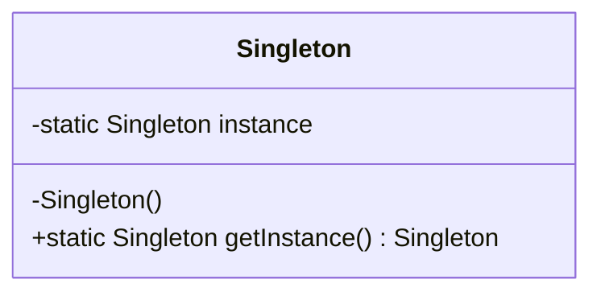

# 📌 싱글톤 패턴 (Singleton Pattern)

> 애플리케이션 전역에서 단 하나의 인스턴스만 전역으로 접근을 보장하는 패턴

## 📝 개요

이 문서는 Head First Design Patterns 5장에서 다루는 **싱글톤 패턴**을 정리한 문서입니다.
싱글톤이 필요한 이유, 구현 방식(Lazy, synchronized, Double-Checked Locking, static 초기화, enum), 전역 변수와의 차이, 실무에서 발생하는 싱글톤 파괴 이슈(Reflection, Serialization, ClassLoader)까지 포함하여 실무적으로 반드시 알아야 하는 내용을 정리했습니다.

---

## 📚 핵심 요약

* 싱글톤은 **1개의 인스턴스만 생성**되도록 보장하는 패턴
* Lazy 방식은 멀티스레드 환경에서 안전하지 않음
* synchronized / DCL / static 초기화로 동시성 문제 해결
* enum 싱글톤은 Reflection, 직렬화/역직렬화, ClassLoader 문제까지 가장 확실하게 방어
* 실무에서는 Spring IoC 컨테이너가 싱글톤 관리를 대신 수행

---

## 1️⃣ 개념 정리

### ■ 배경

전역적으로 접근 가능한 객체가 여러 개 생성되면 데이터 일관성이 깨지고 리소스 낭비, 프로그램이 비정상 동작하는 경우가 있다.
설정 객체, 스레드 풀, 커넥션 풀 등은 반드시 **하나의 객체만 존재**해야 한다.

### ■ 문제 상황

여러 위치에서 무분별하게 `new` 로 객체를 생성하면:

* 일관성 저하
* 리소스 과사용
* 프로그램 비정상 동작
* 멀티스레드에서 동기화 문제 발생

### ■ 왜 필요한가?

* 단일 인스턴스로 리소스 관리
* 전역에서 통일된 접근
* 시스템 안정성 확보

### ■ 구조/흐름

1. 생성자를 private으로 숨겨 외부 직접 생성 방지
2. 클래스 내부에서 단 하나의 인스턴스를 static 변수로 보관
3. static getInstance() 메서드로만 접근 가능
4. 멀티스레드 환경에서는 동기화 전략(DCL, synchronized 등) 필요

### ■ 관련 디자인 원칙

* **캡슐화**: 생성/접근 로직을 한 곳에서 통제
* **전역 접근(Global Access)**을 객체지향적으로 제어


### ■  전역 변수와 싱글톤의 차이

전역 변수와 싱글톤은 모두 **전역 접근이 가능**하지만, 구조적 안정성과 객체지향적 관점에서 큰 차이가 있다.

| 구분               | 전역 변수(Global Variable)                      | 싱글톤(Singleton)                                                   |
|--------------------|--------------------------------------------------|--------------------------------------------------------|
| **생명주기 관리**      | 어려움 (값이 프로그램 전체 흐름에 퍼져 있음)              | 클래스 내부에서 전역 객체의 생명주기 통제                         |
| **네임스페이스 혼잡**  | 높음 (전역에 변수 이름이 많아질수록 충돌 가능성 증가)       | 낮음 (단일 접근 포인트로 캡슐화됨)                               |
| **전역 접근성**       | 매우 높음. 어디서나 값 변경 가능                      | 전역 접근 허용하지만, 접근 방식이 통제됨 (`getInstance()`)         |
| **객체지향적 구조**    | 낮음 (절차지향적)                                   | 높음 (정보 은닉 + 캡슐화)                                    |
| **예상 가능성**       | 낮음 (값 변경 위치 추적 어려움)                        | 높음 (접근 경로가 명확하게 통일됨)                              |
| **테스트 용이성**      | 매우 낮음                                          | DI/Mock으로 대체 가능 (상대적으로 우위)                       |


### 요약

* **전역 변수** → 아무나 접근해서 바꿀 수 있는 *열린 공간*
* **싱글톤** → "의도적으로 관리되는 전역 단일 객체"

### ■ 간단 예시

스레드 풀은 한 시스템에서 여러 개가 생성되면 CPU 스케줄링 혼란, 메모리 과소비 등의 문제가 생김.
→ 단 하나만 두고 모든 요청이 공유하도록 관리해야 함.

---

## 2️⃣ 예제 코드

### ✔ UML 다이어그램 (구조 요약)

UML 클래스 다이어그램에서는 접근 제어자를 다음과 같은 기호로 표현합니다.

| 기호 | 의미       | Java 접근 제어자        |
|------|------------|-------------------------|
| `+`  | public     | `public`                |
| `-`  | private    | `private`               |
| `#`  | protected  | `protected`             |
| `~`  | package    | (default, 패키지 전용)  |

싱글톤 구조를 UML로 표현하면 다음과 같습니다.


### ✔ 기본 Lazy Initialization (싱글 스레드 환경만 안전)

```java
public class Singleton {
    private static Singleton instance;

    private Singleton() {}

    public static Singleton getInstance() {
        if (instance == null) { 
            instance = new Singleton();
        }
        return instance;
    }
}
```

---

### ✔ synchronized 사용 (멀티스레드 안전하지만 성능 저하)

```java
public class Singleton {
    private static Singleton instance;

    private Singleton() {}

    public static synchronized Singleton getInstance() {
        if (instance == null) {
            instance = new Singleton();
        }
        return instance;
    }
}
```

---

### ✔ Double-Checked Locking + volatile (성능 최적화 버전)
### 최초 1회 생성시만 동기화

```java
public class Singleton {
    private static volatile Singleton instance;

    private Singleton() {}

    public static Singleton getInstance() {
        if (instance == null) {                
            synchronized (Singleton.class) {
                if (instance == null) {        
                    instance = new Singleton();
                }
            }
        }
        return instance;
    }
}
```

---

### ✔ Eager Initialization (항상 쓰는 싱글톤이면 가장 단순하고 빠름)
### 스레드 안전, 빠름 / 사용하지 않는 경우에 미리 로딩 

```java
public class Singleton {
    private static final Singleton instance = new Singleton();

    private Singleton() {}

    public static Singleton getInstance() {
        return instance;
    }
}
```

---

### ✔ enum 싱글톤 (모든 문제를 사실상 완벽하게 해결)

```java
public enum Singleton {
    INSTANCE;
}
```

---

## 3️⃣ 실무 포인트

### ✔ 언제 사용하면 좋은가?

* Config, Registry 같은 전역 설정 관리
* Thread Pool / Connection Pool 같은 리소스 제어 객체
* Logging 시스템처럼 공통 기능을 전역에서 공유할 때

---

### ✔ 싱글톤이 해결하는 문제

* 인스턴스 과다 생성 방지
* 리소스 활용 효율화
* 전역 상태 일관성 유지

---

### ✔ 잘못 적용하면 생길 문제

* 테스트에서 Mocking/Isolate 어려움
* 상태가 있는 싱글톤은 사이드 이펙트가 큼
* 멀티스레드 환경에서 잘못 구현하면 객체 두 개 이상 생성됨

---

### ✔ 싱글톤이 깨지는 케이스와 enum의 방어력
싱글톤은 JVM이 클래스 로딩 단계에서 단 한 번만 초기화하도록 보증하기 때문에, 
Java 레벨이 아닌 JVM 레벨에서 싱글톤 안전성이 확보된다.

#### 🔸 1) Reflection

일반 클래스: private 생성자도 강제로 호출 가능 → 싱글톤 파괴
enum: JVM이 enum 인스턴스 생성을 완전히 막음 → **완벽 차단**

#### 🔸 2) 직렬화 / 역직렬화

일반 클래스: 역직렬화하면 새로운 객체가 만들어짐
enum: 내부적으로 readResolve가 보장 → **싱글톤 유지**

#### 🔸 3) 여러 ClassLoader

일반 클래스: 서로 다른 로더에서 여러 인스턴스 생성 가능
enum: 대부분의 일반 애플리케이션 구조에서는 단일 ClassLoader에서 강제 로딩됨 → **실무 환경에서는 사실상 안전**

#### 🔸 4) 멀티스레드

enum은 static 초기화 시점에 단 하나만 생성됨 → **DCL보다 더 안전함**

👉 **정리하면: enum 싱글톤은 Reflection, Serialization, ClassLoader, Thread-Safety 문제를 모두 가장 강력하게 해결한다.**

---

### ✔ Spring에서는?

* Spring Bean 기본 스코프가 Singleton
* 클래스 직접 싱글톤 구현보다 IoC 컨테이너를 통해 관리하는 것이 실무에서는 훨씬 안정적

---

## 4️⃣ 정리

싱글톤 패턴은 전역 객체를 하나만 유지하기 위한 가장 기본적이면서 중요한 패턴이다.
특히 멀티스레드 환경에서는 synchronized, DCL 같은 동기화 전략이 필수적이다.
실무에서는 enum 싱글톤이 가장 안전하며, Spring 환경에서는 Bean 싱글톤을 통해 더 안정적으로 라이프사이클을 관리할 수 있다.

---
