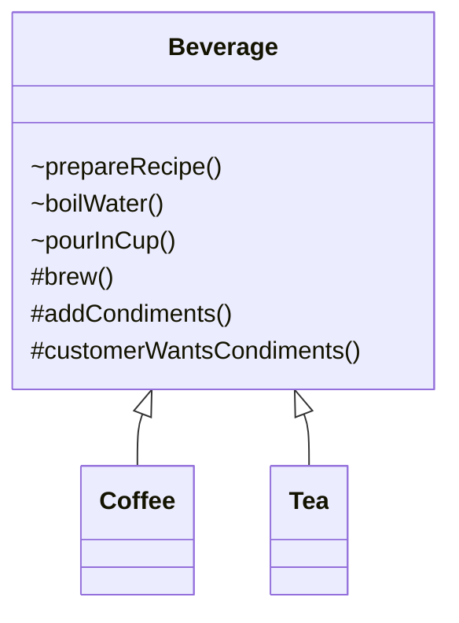

# 📌 Template Method Pattern

> 👉 **알고리즘의 구조는 고정하고, 일부 단계만 서브클래스에 위임하는 행위 패턴**

## 📝 개요

이 문서는 **Template Method Pattern**을 정리한 문서입니다.
해당 패턴의 개념, 등장 배경, 해결하는 문제, 코드 예제, 구조(UML), 실무 사용 포인트 및 JDK/프레임워크 실제 사용 사례를 종합적으로 정리합니다.

## 📚 핵심 요약

* 알고리즘의 **전체 흐름(템플릿)** 은 상위 클래스에서 정의한다
* 변하는 부분만 **서브클래스에서 구현**하도록 위임한다
* **Hook 메서드**를 통해 선택적인 확장을 허용한다
* 프레임워크에서 **제어 흐름을 상위에서 관리**하기 위한 핵심 패턴이다

> 실무 인사이트: *“확장 포인트는 열되, 흐름 제어권은 절대 넘기지 않는다.”*

## 1️⃣ 개념 정리

### ■ 배경

여러 클래스에서 **비슷한 알고리즘 구조**를 가지지만
일부 단계만 다르게 처리해야 하는 상황이 반복되었다.

* 코드 중복 증가
* 알고리즘 흐름 변경 시 여러 클래스 수정 필요
* 공통 흐름을 강제하기 어려움

### ■ 문제 상황

패턴을 적용하지 않으면 다음과 같은 문제가 발생한다:

* 알고리즘 순서가 클래스마다 달라질 수 있음
* 핵심 로직이 서브클래스에 흩어짐
* 유지보수 시 변경 범위 예측 불가

### ■ 왜 필요한가?

Template Method Pattern은 다음을 해결한다:

* 알고리즘의 **구조를 한 곳에서 고정**
* 변경이 필요한 부분만 **확장 포인트로 분리**
* 프레임워크 스타일의 제어 흐름 구현 가능

### ■ 구조 / 흐름

1. 상위 클래스가 알고리즘의 **전체 흐름(templateMethod)** 정의
2. 공통 로직은 일반 메서드로 제공
3. 변경되는 부분은 `abstract` 메서드로 선언
4. 선택적 확장은 **Hook 메서드**로 제공

```java
templateMethod() {
    step1();
    step2();
    hook();
    step3();
}
```

### ■ 관련 디자인 원칙

* **OCP (Open-Closed Principle)**
  → 기존 코드 수정 없이 확장 가능
* **DIP (Dependency Inversion Principle)**
  → 고수준 로직이 저수준 구현에 의존하지 않음
* **Hollywood Principle**
  → *“Don’t call us, we’ll call you”*
  → 제어 흐름은 상위 클래스가 관리
* **캡슐화**
  → 알고리즘 변경 범위를 제한

### ■ 간단 예시 (개념용)

커피와 차는 만드는 과정이 유사하지만
**우리는 재료만 다르다**

* 끓인다 → 우린다 → 컵에 따른다 → 첨가물 추가

## 2️⃣ 예제 코드

### ✔ UML 다이어그램 (구조 요약)



### ✔ 구현 예제 1 – 기본 Template Method

```java
public abstract class Beverage {

    // Template Method
    final void prepareRecipe() {
        boilWater();
        brew();
        pourInCup();
        if (customerWantsCondiments()) {
            addCondiments();
        }
    }

    void boilWater() {
        System.out.println("물 끓이는 중");
    }

    void pourInCup() {
        System.out.println("컵에 따르는 중");
    }

    protected abstract void brew();
    protected abstract void addCondiments();

    // Hook
    protected boolean customerWantsCondiments() {
        return true;
    }
}
```

### ✔ 구현 예제 2 – 서브클래스 구현

```java
public class Coffee extends Beverage {

    @Override
    protected void brew() {
        System.out.println("커피를 우리는 중");
    }

    @Override
    protected void addCondiments() {
        System.out.println("설탕과 우유 추가");
    }
}
```

```java
public class Tea extends Beverage {

    @Override
    protected void brew() {
        System.out.println("차를 우리는 중");
    }

    @Override
    protected void addCondiments() {
        System.out.println("레몬 추가");
    }
}
```

### ✔ 구현 예제 3 – Hook 활용

```java
public class BlackCoffee extends Coffee {

    @Override
    protected boolean customerWantsCondiments() {
        return false; // 아무것도 추가하지 않음
    }
}
```

## 3️⃣ 실무 포인트

### ✔ 언제 사용하면 좋은가?

* 알고리즘 구조는 동일하지만 일부 단계만 다를 때
* 프레임워크 / 라이브러리 설계 시
* 공통 로직의 변경을 한 곳에서 통제해야 할 때

### ✔ 해결하는 문제

* 코드 중복 제거
* 알고리즘 흐름 일관성 유지
* 변경 포인트 명확화

### ✔ 잘못 적용하면 생길 문제

* 상속 구조가 깊어짐
* 런타임 유연성 부족
* Strategy Pattern이 더 적합한데 잘못 선택하는 경우

### ✔ 실무에서 자주 발생하는 이슈

* 테스트 시 서브클래스 mocking 어려움
* 상속 기반 구조로 인해 조합 폭발 발생
* Hook 남용 시 흐름 파악 어려움

### ✔ 프레임워크에서의 활용

#### JDK 사례

* `Arrays.sort()`
  → 알고리즘 템플릿 + `Comparable.compareTo()` 구현
* `AbstractList`
  → `get()`, `size()` 구현 시
  `subList()`, `iterator()` 등 자동 제공
* Swing `JFrame.paint()`
  → Hook 메서드 형태로 확장

## ⚠️ 안 썼을 때 문제

* 알고리즘 변경 시 모든 구현체 수정
* 흐름이 구현체마다 달라짐
* 유지보수 비용 증가

## 💬 면접에서 이렇게 말한다

> “Template Method Pattern은
> 알고리즘의 전체 흐름은 상위 클래스에서 고정하고,
> 변경이 필요한 일부 단계만 서브클래스에 위임하는 패턴입니다.
> 프레임워크에서 제어 흐름을 유지하기 위해 자주 사용됩니다.”

## 4️⃣ 정리

Template Method Pattern은
**확장은 허용하지만 제어는 허용하지 않는** 구조를 만든다.
프레임워크, 라이브러리 설계에서 핵심적인 패턴이며
상속 기반이기 때문에 Strategy Pattern과의 선택이 중요하다.

다음으로 함께 보면 좋은 패턴:

* Strategy Pattern
* Factory Method Pattern